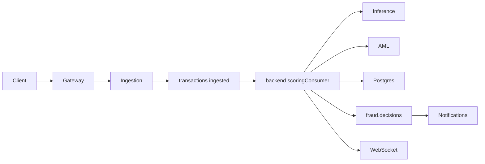

# FraudShield Enterprise Platform Architecture

## Design principles

- **Backend core preserved**: [`backend/server.js`](../backend/server.js) remains the authoritative BFF for auth, transactions, analytics, audit, and WebSocket.
- **Event-driven extension**: Kafka/Redpanda async path for high-throughput ingest via [`services/ingestion-service`](../services/ingestion-service) → [`backend/workers/scoringConsumer.js`](../backend/workers/scoringConsumer.js).
- **Gateway as edge**: [`apps/api-gateway`](../apps/api-gateway) terminates TLS (in prod), rate-limits, and rewrites paths for microservices.

## Service map

| Service | Port | Role |
|---------|------|------|
| api-gateway | 8080 | Edge proxy, path rewrite, rate limit |
| backend | 5000 | Core API, WebSocket, Kafka consumer |
| auth-service | 5001 | OAuth/OIDC bridge, TOTP MFA |
| ingestion-service | 5002 | Validated Kafka ingest |
| scoring-service | 5003 | ML + rules orchestration |
| case-service | 5004 | Fraud case CRUD |
| rules-engine | 5005 | Policy evaluation |
| notification-service | 5006 | Slack/Twilio/Telegram/SMTP/webhook |
| aml-service | 5007 | Sanctions screening |
| sandbox-simulator | 5008 | Fraud/adversarial simulation |
| inference-fastapi | 8000 | Ensemble ML inference |

## Event flow

## Kafka topics

| Topic | Producer | Consumer |
|-------|----------|----------|
| `transactions.ingested` | ingestion, backend | feature-pipeline, scoringConsumer |
| `fraud.decisions` | backend | notification-service |
| `fraud.labels` | backend/admin | (training pipelines) |
| `platform.dlq` | platform-kafka | ops replay |

Shared consumer utilities: [`packages/platform-kafka`](../packages/platform-kafka) — retries, DLQ, idempotency (Redis).

## Security

- JWT auth on REST; optional `WS_REQUIRE_AUTH=true` with `?token=` on WebSocket.
- RBAC via [`backend/middleware/rbac.js`](../backend/middleware/rbac.js); registration cannot self-assign roles.
- Multi-tenant: `x-tenant-id` header + [`backend/middleware/tenant.js`](../backend/middleware/tenant.js).
- AML screening on every scored transaction via [`backend/services/amlClient.js`](../backend/services/amlClient.js).

## ML pipeline

1. Train: `python ml/training/train.py` → `ml/training/artifacts/xgboost-fraud.joblib`
2. MLflow optional via `MLFLOW_TRACKING_URI`
3. Inference loads artifact in [`services/inference-fastapi/app/models/ensemble.py`](../services/inference-fastapi/app/models/ensemble.py)
4. Heuristic ensemble remains fallback when artifact absent

## Gateway path rewrite

| Client path | Service path |
|-------------|--------------|
| `/api/ingest/ingest` | `/ingest` |
| `/api/score/score` | `/score` |
| `/api/notify/notify` | `/notify` |
| `/api/aml/screen` | `/screen` |

## Deployment

- **Local**: `docker compose up` or `scripts/hard-launch.ps1`
- **AWS**: Terraform modules under [`infra/terraform/aws`](../infra/terraform/aws) (VPC, EKS, RDS)
- **Kubernetes**: Helm chart [`infra/k8s/helm/fraudshield`](../infra/k8s/helm/fraudshield)

## Environment variables (production)

See [`backend/.env.example`](../backend/.env.example), gateway service URLs, `KAFKA_BROKERS`, `REDIS_URL`, `STRIPE_SECRET_KEY`, notification channel credentials.
